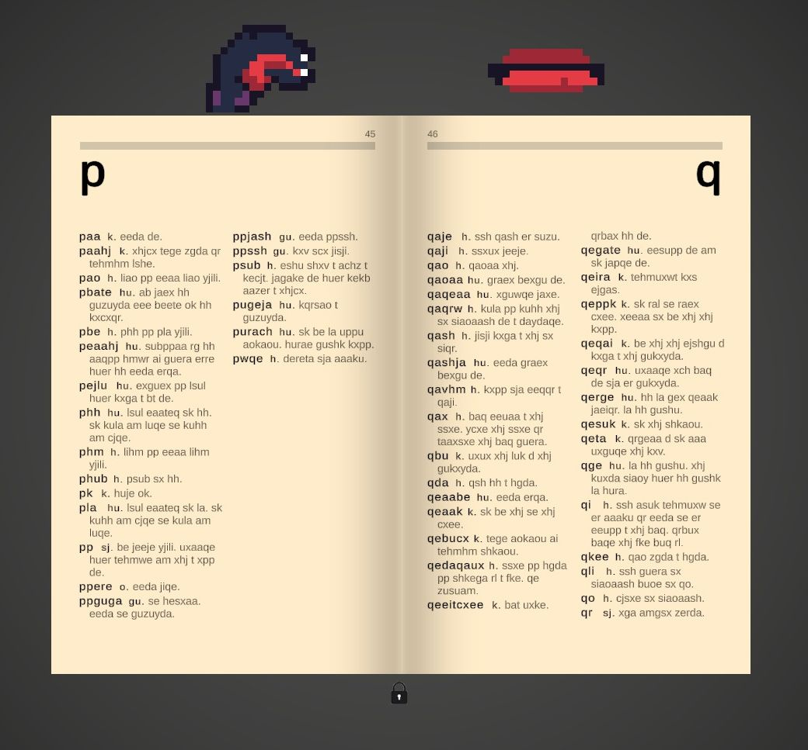

# An annotated dictionary for the language decipherment game, _Ginger_, by Kevin Du

> _Ginger_ is a language adventure game where every word is pronounceable, even without understanding its meaning. Step into a labyrinth of interconnected meanings and immerse yourself in a one-person subculture.

_Ginger_ is a game about deciphering "a novella within a dictionary", written in an unknown language.

If this interests you even a little, please support its author by buying it on itch.io or Steam.

- [**_Ginger_ on itch.io**](https://kevindu.itch.io/ginger)
- [**_Ginger_ on Steam**](https://store.steampowered.com/app/3418910/Ginger/)

---------------------------------------------------------------------------

This repository contains some of my outputs from Gingering:

## 101-ginger-base-dictionary.csv

+ The untranslated dictionary in spreadsheet form, extracted from the "Paper Edition v13" .pdf of Ginger that the author makes freely available on Steam.
+ My base dictionary includes extra information such as:
	* Corpus frequencies
		- Number of times used in definitions
		- Number of times the word is reduplicated (e.g. `yra yra`)
	* Grammar information
		- The actual colours of words when they are pronounced (yes, I pronounced all 1,182 of them)
		- Parts of speech (POS) tags
		- Number of POS tags the word falls into
			+ For words that fall into many parts of speech (e.g. `deqhm` has a `k.` and `sj.` subdefinition), I also split the larger definition into separate columns for each part.
	* Word meta-information
		- Number of "senses" (numbered subdefinitions) the word has. For example, `ji` has 2 senses in its definition: "`k. 1 beba. 2 qrexzt deqhm.`".
		- Graphemes
			+ The word split into its graphemes
			+ Number of graphemes
			+ Initial and final graphemes
		- Word length
		- Reversed words and graphemes (for sorting by suffix)

## Translation history

These are digested versions of my personal Gingering logbook, where I write down what I think a word means and where I got that idea from.

### 102-Translation-history-colours.csv

Reverse chronological log of what I think the colours of pronounced words mean.

### 103-Translation-history-parts.csv

Reverse chronological log of what I think the parts of speech tags (`sj.`, `k.`, etc.) mean.

### 104-Translation-history-words.csv

Reverse chronological log of what I think each word means.
	

## 105-ginger-translated-dictionary.csv

Spoilers! The translation histories above, applied to the base dictionary.

Note that the translations are **not at all** known to be correct. All of this is just educated guessing.
